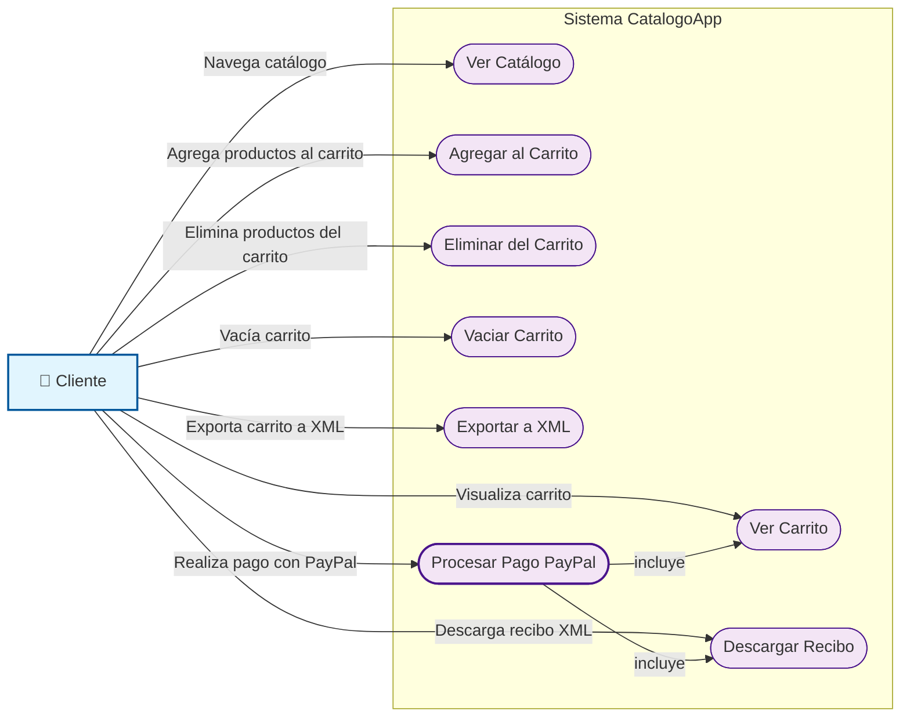
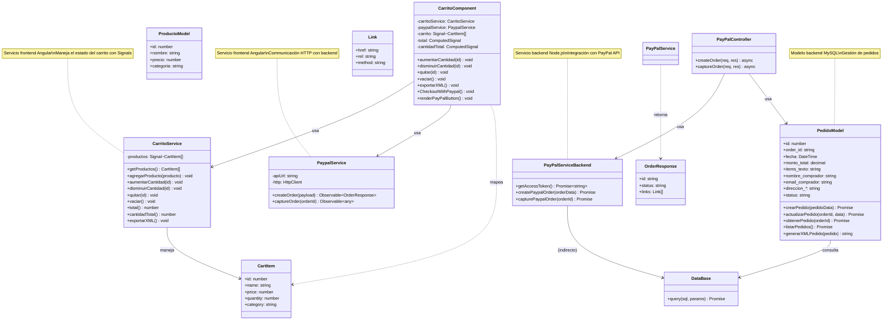
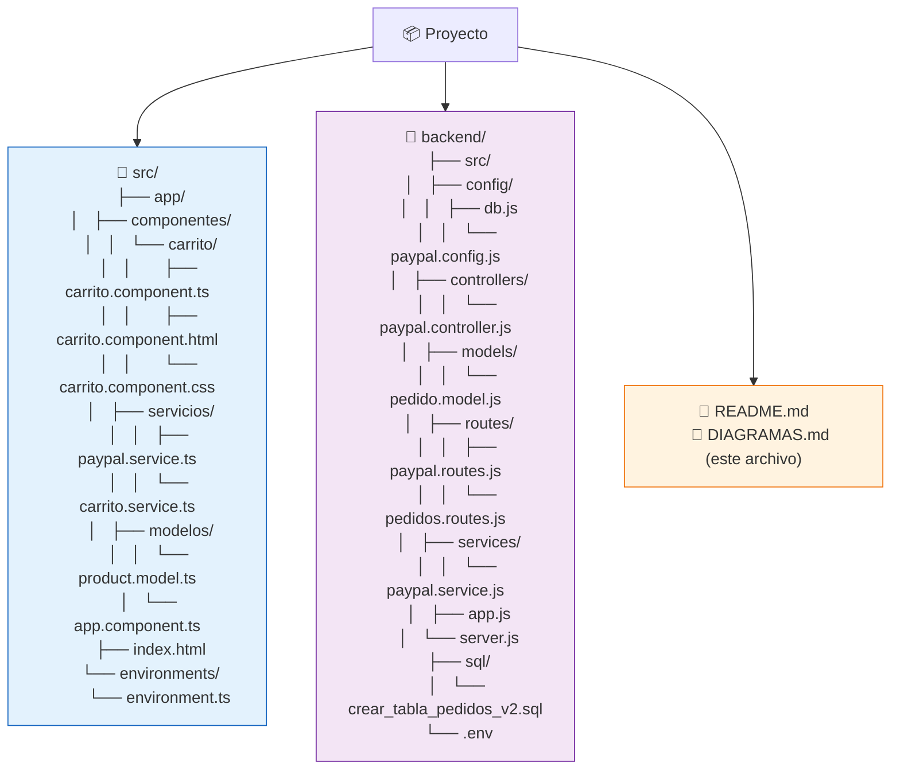
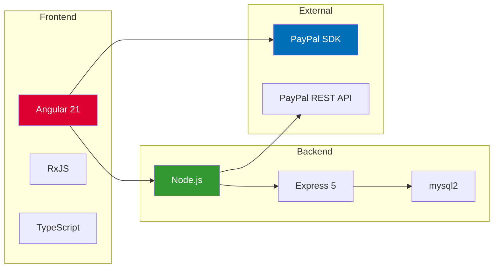

# 📊 Documentación de Diseño - CatalogoApp con PayPal

## 📋 Tabla de Contenidos
1. [Diagrama de Casos de Uso](#diagrama-de-casos-de-uso)
2. [Diagrama de Clases](#diagrama-de-clases)
3. [Diagrama Entidad-Relación (ER)](#diagrama-entidad-relación-er)
4. [Descripción de Componentes](#descripción-de-componentes)

---

## 📖 Diagrama de Casos de Uso



### 📝 Descripción de Casos de Uso

| ID | Nombre | Descripción | Actor |
|----|--------|-------------|-------|
| UC1 | Ver Catálogo | El usuario visualiza todos los productos disponibles | Cliente |
| UC2 | Agregar al Carrito | El usuario añade productos al carrito de compras | Cliente |
| UC3 | Ver Carrito | El usuario visualiza los productos en el carrito | Cliente |
| UC4 | Eliminar del Carrito | El usuario remueve un producto específico | Cliente |
| UC5 | Vaciar Carrito | El usuario elimina todos los productos | Cliente |
| UC6 | Exportar a XML | El usuario descarga el carrito en formato XML | Cliente |
| UC7 | Procesar Pago PayPal | El usuario completa la transacción con PayPal | Cliente |
| UC8 | Descargar Recibo | El usuario obtiene el recibo XML del pedido | Cliente |

---

## 🏗️ Diagrama de Clases



---

## 🗄️ Diagrama Entidad-Relación (ER)

```mermaid
erDiagram
    PRODUCTOS ||--o{ PEDIDOS : "contiene"

    PRODUCTOS {
        int id PK
        string nombre
        decimal precio
        string categoria
        timestamp created_at
        timestamp updated_at
    }

    PEDIDOS {
        int id PK
        string order_id UK "ID de PayPal"
        datetime fecha "Fecha del pedido"
        decimal monto_total "Monto en USD"
        text items_texto "Items formateados"
        varchar nombre_comprador "Nombre del cliente"
        varchar email_comprador "Email del cliente"
        varchar direccion_calle "Calle y número"
        varchar direccion_ciudad "Ciudad"
        varchar direccion_estado "Estado/Provincia"
        varchar direccion_codigo_postal "Código Postal"
        varchar direccion_pais "País (ISO)"
        enum status "pendiente|completado|cancelado"
        timestamp created_at "Registro creado"
    }

    %% Relación (los productos se referencean como texto en items_texto, no foreign key)
    note for PEDIDOS "Los items se guardan como texto legible en items_texto.\nEj: '1. Guitarra Electrica - Cantidad: 2 - Precio: $10500.00'\nEsto permite auditoría sin joins complejos."
```

---

## 🔄 Flujo de Datos PayPal

```mermaid
sequenceDiagram
    actor U as 👤 Usuario
    participant F as 🖥️ Frontend (Angular)
    participant B as 🖧 Backend (Node.js)
    participant P as 💳 PayPal API
    participant DB as 🗄️ MySQL

    U->>F: Hace clic en "Pagar con PayPal"
    F->>B: POST /api/paypal/create-order
    Note right of B: items + total
    B->>P: POST /v2/checkout/orders
    P-->>B: 201 Created (orderID)
    B->>DB: INSERT pedido (status=pendiente)
    B-->>F: { id, status, links[] }
    F->>P: Abre popup con approvalUrl
    Note over U,P: Usuario ingresa datos de pago
    P-->>F: Pago aprobado
    F->>B: POST /api/paypal/capture-order
    B->>P: POST /v2/checkout/orders/{id}/capture
    P-->>B: 200 OK (captureData)
    B->>DB: UPDATE pedido (status=completado, +datos)
    B->>B: Generar XML recibo
    B-->>F: { captureData, xml }
    F->>U: Descarga automática recibo.xml
    F->>DB: (opcional) carrito.vaciar()

    Note over F,B,DB: 💾 Base de datos guarda:\n- order_id, fecha, monto_total\n- items_texto (formato legible)\n- nombre, email, direccion\n- status
```

---

## 📁 Estructura de Archivos



---

## 🗂️ Modelo de Datos Detallado

### Tabla: `productos`
| Campo | Tipo | Descripción |
|-------|------|-------------|
| id | INT PK | ID único del producto |
| nombre | VARCHAR(255) | Nombre del producto |
| precio | DECIMAL(10,2) | Precio en MXN |
| categoria | VARCHAR(100) | Categoría (Guitarras, Cuerdas, etc.) |
| created_at | TIMESTAMP | Fecha de creación |
| updated_at | TIMESTAMP | Última actualización |

### Tabla: `pedidos` (nueva estructura)
| Campo | Tipo | Descripción |
|-------|------|-------------|
| id | INT PK | ID interno del pedido |
| order_id | VARCHAR(255) UK | ID de PayPal (único) |
| fecha | DATETIME | Fecha y hora del pedido |
| monto_total | DECIMAL(10,2) | Monto total en USD |
| items_texto | LONGTEXT | Items formateados como texto legible |
| nombre_comprador | VARCHAR(255) | Nombre del cliente |
| email_comprador | VARCHAR(255) | Email del cliente |
| direccion_calle | VARCHAR(500) | Calle y número |
| direccion_ciudad | VARCHAR(100) | Ciudad |
| direccion_estado | VARCHAR(100) | Estado/Provincia |
| direccion_codigo_postal | VARCHAR(20) | Código postal |
| direccion_pais | VARCHAR(100) | País (código ISO) |
| status | VARCHAR(50) | Estado: pendiente/completado/cancelado |
| created_at | TIMESTAMP | Registro creado |

**Ejemplo de `items_texto`:**
```
1. Guitarra Electrica Ibanez - Cantidad: 2 - Precio unitario: $10500.00
2. Cuerdas D Addario 10-46 - Cantidad: 3 - Precio unitario: $250.00
```

---

## 🔧 Tecnologías Utilizadas



---

## 📝 Notas de Implementación

### 1. **Backend (Node.js + Express)**
- Puerto: `3000`
- CORS habilitado para `localhost:4200`
- Endpoints:
  - `POST /api/paypal/create-order` - Crea orden PayPal
  - `POST /api/paypal/capture-order` - Captura pago
  - `GET /api/pedidos` - Lista pedidos (opcional)
  - `GET /api/pedidos/:orderId` - Obtiene pedido específico

### 2. **Frontend (Angular)**
- Puerto: `4200`
- States con `computed()` y `Signal<>`
- Servicio `PaypalService` para comunicación HTTP
- Botón PayPal integrado con SDK nativo

### 3. **Base de Datos (MySQL)**
- Base: `MDG`
- Tablas: `productos`, `pedidos`
- Motor: InnoDB
- Codificación: utf8mb4

### 4. **PayPal Integration**
- Modo: Sandbox
- Moneda: USD
- SDK: `https://www.paypal.com/sdk/js?client-id=...`
- Flujo: Create Order → Approve → Capture

---

## 🎯 Flujo de Pago Completo

```mermaid
graph TB
    A[Carrito con productos] --> B{Hacer clic en\n"Pagar con PayPal"}
    B --> C[Backend: create-order]
    C --> D[PayPal API: Crear orden]
    D --> E[Guardar pedido BD\nstatus=pendiente]
    E --> F[Frontend: Abrir popup PayPal]
    F --> G[Usuario ingresa datos\ny autoriza pago]
    G --> H[Backend: capture-order]
    H --> I[PayPal API: Capturar fondos]
    I --> J[Actualizar BD\nstatus=completado]
    J --> K[Generar XML recibo]
    K --> L[Descargar recibo\nautomáticamente]
    L --> M[Carrito se vacía]

    style A fill:#e8f5e9
    style L fill:#fff3e0
    style M fill:#ffebee
```

---

## 📋 Checklist de Funcionalidades

- [x] Catálogo de productos
- [x] Carrito de compras (agregar, quitar, vaciar)
- [x] Exportar carrito a XML
- [x] Integración PayPal SDK en frontend
- [x] Creación de órdenes en backend
- [x] Captura de pagos
- [x] Base de datos MySQL
- [x] Guardar pedidos en tabla `pedidos`
- [x] Formato legible de items en BD
- [x] Dirección separada en columnas
- [x] Descarga automática de recibo XML
- [x] Botón PayPal estilizado
- [x] CORS configurado
- [x] Manejo de errores

---

*Documento generado automaticamente - CatalogoApp v1.0*
